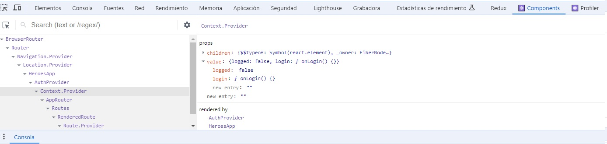

# PROYECTO APP HEROES

## <span style = "color:Salmon">Creamos el proyecto :</span>
```yarn react vite```
```yarn install```
- Borramos todos los archivos de la carpeta src excepto ```main.jsx``` y añadimos un archivo .css que se llama styles.

### <span style = "color:Salmon">Añadimos estilos css de Bootstrap:</span>

Añadimos el link al archivo ***index.html***
``` html
<link href="https://cdn.jsdelivr.net/npm/bootstrap@5.3.3/dist/css/bootstrap.min.css" rel="stylesheet" integrity="sha384-QWTKZyjpPEjISv5WaRU9OFeRpok6YctnYmDr5pNlyT2bRjXh0JMhjY6hW+ALEwIH" crossorigin="anonymous">
```

### <span style = "color:Salmon">Guardar imágenes de los heroes:</span>

Dentro de la carpeta ***src*** creamos una carpeta que se llame ***assets*** y dentro de esta dejamos caer la carpeta  de ***heroes*** que contiene las imágenes:


### <span style = "color:Salmon">Crear los dos módulos: heroes y auth</span>

Dentro de la carpeta ***src*** creamos una carpeta que se llame ***heroes*** y otra carpeta que se llame ***auth***

Dento de ***heroes*** tendremos: carpetas para pages, hooks, helpers, components
Dentro de ***auth*** también tendremos: pages, hooks, components...

```bash
src/
├── assets/heroes
├── auth/
│   ├── components/
│   ├── hooks/
│   └── pages/
├── heroes/
│   ├── components/
│   ├── helpers/
│   ├── hooks/
│   └── pages/
├── HeroesApp.jsx
├── main.jsx
└── styles.css
```

# CREANDO UN PRIMER ROUTER

### <span style = "color:Salmon">Instalamos el React Router:</span>

[ReactRouter](https://reactrouter.com/en/main)

```yarn add react-router-dom@6```
Una vez instalado importamos BrowerRouter en el archivo ***main.jsx*** y envolvemos nuestra aplicación con el componente:

```jsx
import React from 'react';
import ReactDOM from 'react-dom/client';
import { BrowserRouter } from 'react-router-dom';

import { HeroesApp } from './HeroesApp';
import './styles.css';


ReactDOM.createRoot(document.getElementById('root')).render(
  <React.StrictMode>
    
    <BrowserRouter>
        <HeroesApp/>
    </BrowserRouter>
  
  </React.StrictMode>,
)
```
## <span style = "color:Salmon">Creamos directorio para el Router:</span>
Dentro de la carpeta ***src*** creamos una carpeta con ***router*** que contendrá la información de las rutas de mi aplicación
```bash
src/
├── router
├── assets/heroes
├── auth/
│   ├── components/
│   ├── hooks/
│   └── pages/
├── heroes/
│   ├── components/
│   ├── helpers/
│   ├── hooks/
│   └── pages/
├── HeroesApp.jsx
├── main.jsx
└── styles.css
```

### <span style = "color:Salmon">Creamos páginas para navegación dentro de la carpeta heroes/pages y auth/pages</span>
Dentro de pages de la carpeta auth cremos la LoginPage.jsx y dentro de heroes las de DcPage.jsx y MarvelPage.jsx, así mismo ambas carpetas tendran un archivo de barril para simplificar las importaciones.

```bash
src/
├── router
├── assets/heroes
├── auth/
│   ├── components/
│   ├── hooks/
│   └── pages/
│       └── LoginPage.jsx
│       └── index.js
├── heroes/
│   ├── components/
│   ├── helpers/
│   ├── hooks/
│   └── pages/
│       ├── DcPage.jsx
│       └── MarvelPage.jsx
│       └── index.js
├── HeroesApp.jsx
├── main.jsx
└── styles.css
```
Los archivos LoginPage.jsx, DcPage.jsx y MarvelPage.jsx en principio los dejamos de forma simple así:

```jsx
export const LoginPage = () => {
  return (
    <h1>LoginPage</h1>
  )
}
```

### <span style = "color:Salmon">Creamos los Routers dentro de router:</span>
Al router principal de la aplicación se le suele dar el nombre de ```AppRouter.jsx```

```jsx
import { Route, Routes } from "react-router-dom"
import { DcPage, MarvelPage } from "../heroes/pages"
import { LoginPage } from "../auth/pages/LoginPage"


export const AppRouter = () => {
  return (
    <>
        <Routes>
            <Route path="marvel" element={<MarvelPage/>} />
            <Route path="dc" element = {<DcPage/>}/>          
            
            <Route path="login" element={<LoginPage/>} />
        </Routes>

    </>
  )
}

```
Para que funcione el router tenemos que colocar el componente ```<AppRouter/>``` dentro de la aplicación en el componente HeroesApp.jsx

En este momento nos aparecería un mensaje con este error/ advertencia:

Nos está pidiendo una página para que dirija la busqueda de la ruta con el path="/" que sirva de comodín en caso de que no tengamos ninguna

Añadimos ```<Route path="/" element={<Navigate to="/marvel"/>} />``` en nuestro archivo ***AppRouter.jsx***, agregando la importación a Navigate: 
```jsx
import { Navigate, Route, Routes } from "react-router-dom"
```

# COLOCAR CLASE DE LA RUTA ACTIVA

## <span style = "color:Salmon">Creamos nuevo modulo UI:</span>
Para hacerlo crearemos primero un nuevo módulo que se llamara ui (user interface), ya que el navbar podría pertenecer a heroes, pero también a auth.

Creamos el modulo y añadimos las carpetas ***components*** y ***hooks*** dentro de él. Así mismo creamos el archivo Navbar.jsx

Crearemos también los archivos de barril dentre de ***components*** y dentro de ***ui*** para facilitar las importaciones.

```bash
src/
├── router
│   └── AppRouter.jsx
├── assets/heroes
├── ui/
│   ├── components/
│       ├── Navbar.jsx
│       └── index.js
│   ├── hooks/
│   └── index.js
├── auth/
│   ├── components/
│   ├── hooks/
│   └── pages/
│       ├── LoginPage.jsx
│       └── index.js
├── heroes/
│   ├── components/
│   ├── helpers/
│   ├── hooks/
│   └── pages/
│       ├── DcPage.jsx
│       ├── MarvelPage.jsx
│       └── index.js
├── HeroesApp.jsx
├── main.jsx
└── styles.css
```

## <span style = "color:Salmon">Añadimos el componente Navbar.jsx:</span>
Copiamos el siguiente código dentro de la carpeta ui/components

```jsx
import { Link, NavLink } from 'react-router-dom';

export const Navbar = () => {
    return (
        <nav className="navbar navbar-expand-sm navbar-dark bg-dark p-2">
            
            <Link 
                className="navbar-brand" 
                to="/"
            >
                Asociaciones
            </Link>

            <div className="navbar-collapse">
                <div className="navbar-nav">

                    <NavLink 
                        className={({ isActive })=>`nav-item nav-link ${isActive ? 'active': ''}`} 
                        to="/marvel"
                    >
                        Marvel
                    </NavLink>

                    <NavLink 
                        className={({ isActive })=>`nav-item nav-link ${isActive ? 'active': ''}`} 
                        to="/dc"
                    >
                        DC
                    </NavLink>
                </div>
            </div>

            <div className="navbar-collapse collapse w-100 order-3 dual-collapse2 d-flex justify-content-end">
                <ul className="navbar-nav ml-auto">
                  <span className="nav-item nav-link text-info">
                    Ramón 
                  </span>
                  <button className="nav-item nav-link btn">Logout</button>
                </ul>
            </div>
        </nav>
    )
}
```
y Añadimos el nuevo componente creado <Navbar/> al archivo AppRouter de nuestra aplicación:

```jsx
import { Navigate, Route, Routes } from "react-router-dom"
import { DcPage, MarvelPage } from "../heroes/pages"
import { LoginPage } from "../auth/pages/LoginPage"
import { Navbar } from "../ui"


export const AppRouter = () => {
  return (
    <>
    <Navbar/>
        <Routes>
            <Route path="marvel" element={<MarvelPage/>} />
            <Route path="dc" element = {<DcPage/>}/>          
            <Route path="/" element={<Navigate to="/marvel"/>} />

            <Route path="login" element={<LoginPage/>} />
        </Routes>

    </>
  )
}

```

### <span style = "color:Salmon">Crear un segundo router</span>

Para poder mostrar la pantalla de login distinta de como se ve la de heroes debemos separar ambas estructuras html.

Para ello vamos a crearnos una carpeta ***routes*** dentro de heroes y dentro de esta carpeta creamos un componente ```HeroesRoutes.jsx```que albergará el ```<Navbar/>``` que tendremos que quitar de ```AppRouter.jsx```.

```bash
src/
├── router
│   └── AppRouter.jsx
├── assets/heroes
├── ui/
│   ├── components/
│       ├── Navbar.jsx
│       └── index.js
│   ├── hooks/
│   └── index.js
├── auth/
│   ├── components/
│   ├── hooks/
│   └── pages/
│       ├── LoginPage.jsx
│       └── index.js
├── heroes/
│   ├── components/
│   ├── helpers/
│   ├── hooks/
│   ├── pages/
│       ├── DcPage.jsx
│       ├── MarvelPage.jsx
│       └── index.js
│   └── routes/
├── HeroesApp.jsx
├── main.jsx
└── styles.css
```

El archivo ***HeroesRoutes.jsx*** lo usaremos para apuntar a las rutas de las páginas de heroes, así que tendremos que quitarlas del AppRouter.jsx y ponerlas ahí.

##### HeroesRoutes.jsx: 
```jsx
import { Navigate, Route, Routes } from "react-router-dom";
import { Navbar } from "../../ui";
import { DcPage, MarvelPage } from "../pages";

export const HeroesRoutes = () => {
  return (
    <>
        <Navbar/>
        <Routes>
            <Route path="marvel" element={<MarvelPage/>} />
            <Route path="dc" element = {<DcPage/>}/>          
            
            
            <Route path="/" element={<Navigate to="/marvel"/>} />
        </Routes>
    </>
  )
}

```
y por otro lado ahora el archivo ***AppRouter.jsx*** que quitando lo que ya utilizamos en el nuevo router nos quedaría así:


pero nos darí este error, por lo que debemos poner el path="/*":

```jsx
        <Route path="/*" element={<HeroesRoutes/>}/>
```

Para terminar vamos al archivo ***AppRouter.jsx*** y envolvemos las routes en nuevo div con la className = "container" para poder darle unos padding y un diseño especial, además añadiremos un par de páginas más ***SearchPage.jsx*** que aparecerá en el navBar y otra ***HeroPage.jsx*** que no estará en el navbar.

```jsx
import { Navigate, Route, Routes } from "react-router-dom";
import { Navbar } from "../../ui";
import { DcPage, HeroPage, MarvelPage, SearchPage } from "../pages";

export const HeroesRoutes = () => {
  return (
    <>
        <Navbar/>
        <div className="container">
            <Routes>
                <Route path="marvel" element={<MarvelPage/>} />
                <Route path="dc" element = {<DcPage/>}/>   

                <Route path="hero" element = {<HeroPage/>}/>   
                <Route path="search" element = {<SearchPage/>}/>          
                               
                <Route path="/" element={<Navigate to="/marvel"/>} />
            </Routes>
        </div>
       
    </>
  )
}
```
y en el ***Navbar.jsx*** añadimos:
```jsx
<NavLink 
                        className={({ isActive })=>`nav-item nav-link ${isActive ? 'active': ''}`} 
                        to="/hero"
                    >
                        Hero
                    </NavLink>
```

```bash
src/
├── router
│   └── AppRouter.jsx
├── assets/heroes
├── ui/
│   ├── components/
│       ├── Navbar.jsx
│       └── index.js
│   ├── hooks/
│   └── index.js
├── auth/
│   ├── components/
│   ├── hooks/
│   └── pages/
│       ├── LoginPage.jsx
│       └── index.js
├── heroes/
│   ├── components/
│   ├── helpers/
│   ├── hooks/
│   ├── pages/
│       ├── DcPage.jsx
│       ├── MarvelPage.jsx
│       ├── HeroPage.jsx
│       ├── SearchPage.jsx
│       └── index.js
│   └── routes/
├── HeroesApp.jsx
├── main.jsx
└── styles.css
```

### <span style = "color:Salmon">Navigate push / replace / useNavigate</span>

Ahora vamos a hacer que al pulsar el botón de ```LOGOUT``` nos lleve a la pantalla del ```LOGIN```.

1. SALIR CON EL LOGOUT
   Abrimos Navbar.jsx
Añadimos una función al onClick
```jsx
 <button onClick={onLogout} className="nav-item nav-link btn">Logout</button>
```
y creamos la función flecha que se activará al hacer onClick:

Para que podamos salir de la página al hacer onClik y disparar la función tenemos que importar el ***hook*** <span><b>useNavigate();</b></span>

Para llegar al push y al replace usamos el custom hook de ***useNavigate***

[Documentación useNavigate](https://reactrouter.com/en/main/hooks/use-navigate)


```jsx
import { Link, NavLink, useNavigate } from 'react-router-dom';

export const Navbar = () => {

        const navigate = useNavigate();
        
        const onLogout = () =>{
            navigate()
        }
  
    return (
        ...resto del navigate.jsx
```

Si nos ponemos con el cursor sobre la función navigate() nos muestra dos opciones:


El Delta (poco usado), y el to:to, options?

Este ***to*** sería ponerle la ruta a donde queremos navegar:
```jsx
navigate('/login')
```

La función ya nos llevaría al Login, pero si pulsamos volver atrás nos devuelve a la página anterior y eso no es lo correcto ya que si nos hemos deslogueado al pulsar atrás debería pedirnos las credenciales de nuevo.


```jsx
navigate('/login',{replace:true})
```
**nota:** para comprobar que funciona copiamos la url y la pegamos en una nueva pestaña del navegador.

El replace eveita que el usuario pueda regresar a la ventana anterior.


2. ENTRAR CON EL LOGIN
   Abrimos el auth/LoginPage.jsx

Aplicamos el mismo sistema anterior para hacer el Login y que nos dirija a la página de Marvel.
```jsx
import { useNavigate } from "react-router-dom"

export const LoginPage = () => {
  
  const navigate = useNavigate();
  const onLogged = () => {
    navigate('/marvel', {replace: true})
  }
  
  return (
    <div className="container mt-5">
      <h1>Login</h1>
      <hr/>

      <button 
        className="btn btn-primary"
        onClick={ onLogged }
        >
        Login
      </button>
    </div>
  )
}
```

# Lista de Heroes

- Creamos archivo con los datos de heroes en heroes/data/
  
En este caso usamos una lista de json de los heroes, no una consulta http así que copiamos los datos de heroes en un archivo dentro de la carpeta heroes/data/heroesData.js

El archivo tiene esta estructura:
```js
export const heroes = [{
        'id': 'dc-batman',
        'superhero': 'Batman',
        'publisher': 'DC Comics',
        'alter_ego': 'Bruce Wayne',
        'first_appearance': 'Detective Comics #27',
        'characters': 'Bruce Wayne'
    },
    ...
```

- Creamos un par de funciones dentro de la carpeta heroes/helpers:

### <span style = "color:Salmon">Función getHeroesByPublisher.js</span>

Es una función que me permitirá obtener los heroes por Publisher.
Tenemos los publisher: "DC Comics" o los publisher:"Marvel Comics"

importamos la lista de heroes:

```js 
import { heroes } from "../heroesData";
```

En la función que creamos recibiremos el publisher como argumento:
```js
export const getHeroesByPublisher = (publisher) => {
}
```

Lo primero que hará la función es comprobar si el publisher es válido ya que solo podemos recibir de dos tipos. Creo un array con los publisher válidos.
```js
const validPublisher = ['Dc Comics', 'Marvel Comics'];

```
Luego compruebo con un if si el publisher que recibo por el argumento está dentro de los validPublisher y si no es así lanzo un error.

```js
if (!validPublisher.includes(publiser)) {
        trhow new Error(`${ publiser } is not a valid publisher`)
    }

```

En caso que sea un publisher válido devuelvo el filtro de heroes que coincidan con el argumento:
    
```js
return heroes.filter(hero => hero.publisher === publisher);

```

Así mi función devolverá un array con los publisher que coincidan con el publisher del argumento.

#### ¿Dónde ejecutamos esta función?

Ahora tenemos que abrir la página de DC o la de Marvel.

Contruiríamos algo como esto:
```js
export const DcPage = () => {
  return (
    <>
      <h1>DC Comics</h1>
      <hr/>

      <ul>
        <li>Batman</li>
        <li>Superman</li>
        <li>...</li>
      </ul>
    </>
  )
}
```


Ya nos está indicando que vamos a necesitar un nuevo componente para renderizar el listado:


### <span style = "color:Salmon">HeroList.jsx</span>

Creamos un nuevo componente dentro heroes/components/HeroList.jsx

Este componente es el que mandará ejecutar la función getHeroesByPublisher


En ***DcPage.jsx*** sustituimos el ```<ul>```por el nuevo componente que generará la lista: ***```<HeroList.jsx>```*** y este componente tendrá la prop publisher que será igual a 'DC Comics' o 'Marvel Comics' según la página en que nos encontremos.

```jsx
import { HeroList } from "../components/HeroList";

export const DcPage = () => {
  return (
    <>
      <h1>DC Comics</h1>
      <hr/>

    <HeroList publisher = 'DC Comics'/>
      
    </>
  )
}
```

A HeroList le llegará la prop publisher con el value = DC Comics y podrá ejecutar la función getHeroesByPublisher para generar el listado de heroes.

```jsx
import { getHeroesByPublisher } from "../helpers/getHeroesByPublisher"

export const HeroList = ( {publisher}) => {
    
    const heroes = getHeroesByPublisher(publisher)
    
  return (
    
    <ul>
        {
        heroes.map((hero)=>{
           return( <li 
                key= {hero.id }
            >{hero.superhero}</li>
        )
        })
        }
    </ul>
    
  )
}
```

Ahora hay que hacer lo mismo en el componente de MarvelComics.jsx***

### <span style = "color:Salmon">Tarjetas con la información del Héroe</span>

El objetivo de esta sección es crear unas tarjetas que tengan la información de los heroes y crear un acceso para ver la página del heroe.

#### Modificamos el archivo HeroList.jsx:

Cambiamos el ```ul```por un div para poder ponerle clases:

```jsx
import { getHeroesByPublisher } from "../helpers/getHeroesByPublisher"

export const HeroList = ( {publisher}) => {
    
    const heroes = getHeroesByPublisher(publisher)
    
  return (
    
    <div className="row rows-cols-1 row-cols-md-3 g-3">
        {
        heroes.map((hero)=>{
           return( <li 
                key= {hero.id }
            >{hero.superhero}</li>
        )
        })
        }
    </div>
    
  )
}

```

>**nota ClassName de  Bootstrap** 
>la clase que utizamos es : ```row rows-cols-1 row-cols-md-3 g-3```
>1. ***.row:*** Esta clase se utiliza para crear una fila en el sistema de cuadrícula de Bootstrap. Dentro de una fila, puedes colocar columnas que se ajustarán automáticamente al ancho disponible. Es esencial para estructurar el layout en Bootstrap.
>
>2. ***.row-cols-1:*** Esta clase define que la fila tendrá una columna en todos los tamaños de pantalla. Es decir, los elementos dentro de esta fila se organizarán en una sola columna en pantallas pequeñas y grandes.
>
>3. ***.row-cols-md-3:*** Esta clase indica que la fila tendrá tres columnas en pantallas de tamaño mediano (768px y superior) y más grandes. En pantallas más pequeñas, las columnas se ajustarán automáticamente según el espacio disponible.
>
>3. ***.g-3:*** Esta clase aplica un espacio de "gutters" (márgenes) de 3 unidades entre las columnas. El valor 3 es relativo a las unidades de espaciado de Bootstrap.

### <span style = "color:Salmon">Crear un nuevo componente que reciba todas las propiedades del heroe: HeroCard.jsx</span>

A ese componente le llegarán todas estas props:
```jsx
export const HeroCard = ({ id, superhero, publisher,alter_ego, first_appearance, characters }) => {
        
       
  return (
    <div>HeroCard</div>
  )
}
```
#### Actualizamos nuestro HeroList.jsx y sustituimos el ```<li>```por el nuevo componente HeroCard.jsx:


Al componente HeroCard.jsx necesito mandarle todas estas propiedades y la key:


Lo podemos hacer directamente con un spread (...):

```jsx
 {
        heroes.map((hero)=>{
           return( 
           <HeroCard 
              key={ hero.id }
              { ...hero }

           />
        )
        })
        }
```
### <span style = "color:Salmon">diseño de la hero-card:</span>

Queremos una targeta con la imagen a un lado y el texto a otro:
comenzamos con estas clases del Bootstrap:
```jsx
 <div className="col">
        <div className="card"> 


        </div>   
   </div>
```
>1. ***.col:*** En el sistema de cuadrícula de Bootstrap, la clase col se utiliza para definir una columna dentro de una fila (row). Bootstrap utiliza un sistema de cuadrícula de 12 columnas, y las clases de columna (col) son responsables de la distribución del espacio dentro de la fila.
>
>2. ***.card:*** La clase card en Bootstrap se utiliza para crear un contenedor de contenido flexible y extensible. Las tarjetas (card) son componentes de interfaz de usuario que pueden contener una variedad de contenidos y elementos, como texto, imágenes, listas de elementos, encabezados, pies de página, etc.

Creamos una constante para guardar la url de la imagen y ponemos un par de clases más para definir las targetas:

```jsx
export const HeroCard = ({ id, superhero, publisher,alter_ego, first_appearance, characters }) => {
     
    const heroImgUrl = `../../src/assets/heroes/${id}.jpg`;
       
  return (
   <div className="col">
        <div className="card"> 
            <div className="row no-gutters"> 
                <div className="col-4">
                    
                </div>

            </div>

        </div>   
   </div>
  )
}
```
Ya tenemos la imagen de los heroes:


añadimos el titulo, el alter_ego y los characters.

```jsx
 return (
   <div className="col">
        <div className="card"> 
            <div className="row no-gutters"> 
                <div className="col-4">
                    
                </div>
                <div className="col-8">
                    <div className="card-body">
                        <h5 className="card-title">{ superhero }</h5>
                        <p className="card-text">{ alter_ego }</p>

                        <p >{ characters }</p>
                    </div>
                </div>
            </div>

        </div>   
   </div>
  )
}
```
Aquí nos damos cuenta que hay heroes que repiten el alter_ego y el characters, como pasa con Green Arrow o Wonder Woman:


### <span style = "color:Salmon">Formas de condicionar la visualización del "characters" en el HeroCard.jsx</span>


##### 1ª Forma:
Poniendo un condicional concatenado:

```jsx
...resto del código
 <h5 className="card-title">{ superhero }</h5>
                        <p className="card-text">{ alter_ego }</p>
                        {
                            ( alter_ego !== characters) 
                            &&
                            (<p >{ characters }</p>)
                        }                     
                    </div>
                </div>

...resto del código
```
Con esto estamos diciendo que si el alter_ego es distinto a charateres muestra el characters.

##### 2ª Forma:
Podríamos poner una constante para definir el componente:
```jsx
...
 const charactersByHero = (<p>{ characters }</p>)
  return (
    (...resto del código)
                      {
                            ( alter_ego !== characters) 
                            &&
                            charactersByHero
                        }  
```

##### 3ª Forma:
Creando un componente que no se exporta antes de definir el HeroCard:
```jsx
import { Link } from "react-router-dom";

const CharactersByHero = ({alter_ego, characters}) => {
    if( alter_ego === characters)return (<></>);
    
    return <p>{ characters }</p>
}
(...)
              <h5 className="card-title">{ superhero }</h5>
                <p className="card-text">{ alter_ego }</p>
                  <CharactersByHero characters={ characters} alter_ego={ alter_ego}/> 
                <p className="card-text">
(...)
```
##### 4ª Forma:
Sería una modificación de la 3ª solo cambiando el if del nuevo componente por un ternario:
```jsx
const CharactersByHero = ({alter_ego, characters}) => {
    return ( alter_ego === characters )
    ? <></>
    : <p>{ characters }</p>;
}
```

Añadimos para terminar los datos del heroe la ```first_appearance```

```jsx
<p className="card-text">
<small className="text-muted">{ first_appearance }</small>
</p> 
```

### <span style = "color:Salmon">Link para mostrar mas info del superheroe</span>

Para ello vamos a importar el ***Link*** de React-router-dom:

```jsx
import { Link } from "react-router-dom";
```
[Mas...](./img/masInfo.jpg)

```jsx
<Link to={'/hero'}>
    Más...
</Link>
```

El problema es que siempre mostramos la misma ruta al pinchar en Más... y estamos en superman nos gustaría que la ruta nos llevara a superman, es decir:

Tenemos esto: ```http://localhost:5173/hero ``` pero nos gustaría que tomara la ruta al superheroe que hemos pinchado ```http://localhost:5173/hero/dc-batman```

Con este cambio en el HeroCard.jsx ya lo tendríamos, recordemos que tenemos que importar Link:
```jsx
import { Link } from "react-router-dom";
(...)
 <Link to={`/hero/${ id }`}>
   Más...
</Link>
```
Una vez navega a esa ruta específica del heroe, vemos que no nos muestra nada, no tiene una ruta establecida con cada heroe. 
>*No se usa la ruta comodín porque ésta la tenemos en el AppRouter.jsx,no en el HeroesRoutes.jsx*

Podríamos añadir una ruta comodín en HeroesRoutes pero eso no es lo que queremos.

### <span style = "color:Salmon">Leer argumentos por Url</span>

Tenemos que hacer que se lea el url del superheroe y nos lleve a la página del heroe.

Si miramos nuestro componente de rutas de heroes (HeroeRoutes.jsx), la página de HeroPage solo se nos muestra si tenemos en el path:
```jsx
<Route path="hero" element = {<HeroPage/>}/>  
```
si quisiéramos ver la página de un heroe tendríamos que colocarlo así:
```jsx
<Route path="hero/marvel-spider" element = {<HeroPage/>}/>  
```
pero esto implicacaría que tendríamos que tener un path para cada heroe:
```jsx
<Route path="hero/marvel-spider" element = {<HeroPage/>}/>  
<Route path="hero/marvel-captain" element = {<HeroPage/>}/>
<Route path="hero/marvel-daredevil" element = {<HeroPage/>}/>
<Route path="hero/marvel-wolverine" element = {<HeroPage/>}/>
...etc
```
Esto resultaría inviable, podrían ser miles, así que lo que vamos a mandar va a ser un comodín:
```jsx
<Route path="hero/:heroId" element = {<HeroPage/>}/>  
```
Si observamos ahora el componente en el React.Provider, tenemos dentro de value los matches:


Para poder obtener ese match desde Route.Provider tenemos un **Hook**. La información se encuentra ahora en el contexto de nuestra aplicación.

Vamos a trabjaar en el componente de la página de **HeroPage.jsx**

importamos useParams de React-dom y creamos una constante ```params``` que nos va a servir para obtener los parámetros:
```jsx
import { useParams } from 'react-router-dom';

export const HeroPage = () => {

  const params = useParams();

  return (
    <>
    
    <h1>HeroPage</h1>
    </>
  )
}
```
Si hacemos un console.log de los params tenemos:


Ahora ya podemos ir a HeroPage.jsx y desestructurar el heroId de params

```jsx
 import { useParams } from 'react-router-dom';

export const HeroPage = () => {

  const {heroId} = useParams();

  return (
    <>
    <h1>{heroId}</h1>
    </>
  )
}
```

Ahora necesitamos hacer una función para obtener el heroe que la persona está buscando con el heroId.
Dentro de heroes/helpers creamos un archivo con la función:
**getHeroById**

Importamos nuestros datos de heroes:
```js
import { heroes } from "../heroesData";
```

Vamos a devolver en la función el heroe cuyo id coincida con el id que estamos buscando. Como tenemos un arreglo ocupamos el find.

```js
import { heroes } from "../heroesData";

export const getHeroById = ( id ) =>{
    
 return heroes.find(hero => hero.id === id)
}
```
en caso que el find no lo encuentre devolverá un ***undefined***

Ahora ya podemos regresar al componente de ***HeroPage.jsx*** y crear una constante para guardar lo que nos devuelva la función de getHeroById(id):

```jsx
import { useParams } from 'react-router-dom';
import { getHeroById } from '../helpers';

export const HeroPage = () => {

  const {heroId} = useParams();

  const hero = getHeroById(heroId);
  console.log(hero)
  return (
    <>
    <h1>{heroId}</h1>
    </>
  )
}
```
El ```console.log(hero)``` nos devuelve:


Tal y como está el código ahora mismo si el usuario intenta jugar con la url y poner un id que no existe nos devolvería un error. Para que eso no suceda vamos comprobar si tenemos heroe y en caso de que no lo tengamos lo sacamos de la página de heroe:

```jsx
 if( !hero ){
    return <Navigate to="/marvel"/>
  }
```
Como React es secuencial, cuando el código llegue a ese condicional nos sacará a la página de marvel si no encuentra hero.
```jsx
import { Navigate, useParams } from 'react-router-dom';
import { getHeroById } from '../helpers';

export const HeroPage = () => {

  const {heroId} = useParams();

  const hero = getHeroById(heroId);

  if( !hero ){
    return <Navigate to="/marvel"/>
  }

  return (
    <>
    <h1>{heroId}</h1>
    </>
  )
}
```
### <span style = "color:Salmon">Estilo del componente HeroScreen</span>

Ya tenemos el heroe en **HeroPage.jsx** ahora seguiremos con el diseño de la pantalla usando las clases de Bootstrap

Queremos crear una tarjeta donde la parte izquierda de la misma contenga la foto y la parte derecha los datos del heroe. Con un botón para regresar a la pantalla anterior.
Parte izquierda de la ficha (foto):
```jsx
  return (
    <div className='row mt-5'>
     <div className="col-4">
      
     </div>
    </div>
  )
```

> **row** :Esta clase se utiliza para crear una fila en el sistema de cuadrícula de Bootstrap. Cada fila (row) debe contener columnas (col-) para alinear el contenido de manera adecuada. Las filas aseguran que las columnas se agrupen correctamente para el diseño en pantalla.
> 
> **mt-5** Esta es una clase de utilidad de Bootstrap que añade un margen superior (mt significa "margin-top"). 
> 
> **col-4** Esta clase define una columna que ocupa 4 de las 12 unidades disponibles en la cuadrícula de Bootstrap
> 
> **img-thumbnail** Esta clase se aplica a las imágenes para darles un borde, un poco de padding, y un fondo blanco. También hace que la imagen tenga bordes redondeados.


Parte derecha de la ficha (características):
```jsx
<div className="col-8">
      <h3>{ hero.superhero }</h3>
      <ul className='list-group list-group-flush'>
          <li className='list-group-item'> <b>Alter ego: </b>{ hero.alter_ego }</li>
          <li className='list-group-item'> <b>Publisher: </b>{ hero.publisher }</li>
          <li className='list-group-item'> <b>First appearance: </b>{ hero.first_appearance }</li>     
      </ul>
      <h5 className='mt-3'>Characters</h5>
      <p>{ hero.characters }</p>
      <button className='btn btn-outline-primary'>Regresar</button>
     </div>
```

> **list-group**  Esta clase proporciona un conjunto de estilos que se pueden aplicar a elementos de lista ```(<ul>, <ol>, <div>)``` y a los elementos de la lista```(<li>, <a>, <button>)```.Estos estilos incluyen bordes, espaciado y alineación que hacen que los elementos de la lista se vean consistentes y atractivos.
> 
> **list-group-flush**  se utiliza junto con list-group para eliminar los bordes y el padding predeterminados del contenedor de la lista y de los elementos de la lista, haciendo que los elementos de la lista se alineen al ras (flush) con su contenedor. Esto es útil cuando deseas que los elementos de la lista se integren de manera más uniforme en un diseño, especialmente cuando están dentro de un contenedor con bordes, como una tarjeta (card).
> 
> **list-group-item**  Esta clase aplica estilos específicos  al elemento de lista, haciéndolo parte de un grupo de lista con bordes, padding, y un estilo visual uniforme.

Ahora aplicamos la funcionalidad al ```<button>```
En el onClick aplicamos la función onNavigateBack
```jsx
<button onClick={ onNavigateBack } className='btn btn-outline-primary'>Regresar</button>
```
Para navegar atrás importaremos primero el useNavigate:
```jsx
import { Navigate, useNavigate, useParams } from 'react-router-dom';
```
y creamos una constante para guardar el useNavigate:
```js
const navigate = useNavigate();
```
y posteriormente ejecutamos la función onNavigateBack: Al poner (-1) navegamos a la página anterior.
```jsx
const onNavigateBack = () =>{
    navigate(-1);
  }
```

### <span style = "color:Salmon">Nota: useMemo</span>

Como mejora vamos a usar el useMemo en el ***HeroPage.jsx*** y en el ***HeroList.jsx***. No es porque este ejercicio lo necesite pero si usamos datos de un fetch por ejemplo nos evitaría estar continuamente renderizando los datos.

Cuando llamamos funciones que están dentro de nuestra raíz del functional component cada vez que haya un cambio de estado puede volver a dispararse esa parte:


>*nota:* ***useCallback()*** para memorizar funciones y ***useMemo()*** para memorizar los valores.

Importamos useMemo de React:
```jsx
import { useMemo } from 'react';
```
Aplicamos el useMemo, y le asignamos la dependencia para que solo cambie cuando también cambie el heroId:
```jsx
const hero = useMemo(()=> getHeroById( heroId ),[ heroId ])
```

Hacemos los mismo en **HeroList.jsx**

Pasamos de esto:
```jsx
 const heroes = getHeroesByPublisher(publisher)
```
a esto:
```jsx
const heroes = useMemo(()=>getHeroesByPublisher(publisher),[ publisher ])
```

### <span style = "color:Salmon">Animaciones de nuestro componente</span>

Usaremos **[Animate.css](https://animate.style/)** para darle movimiento a nuestra presentación.

Copiamos el CDN y lo pegamos en el head de index.html:
```html
 <link
    rel="stylesheet"
    href="https://cdnjs.cloudflare.com/ajax/libs/animate.css/4.1.1/animate.min.css"
  />
```
En la HeroCard.jsx le aplicamos la clase de Animationcss
```jsx
 <div className="col animate__animated animate__fadeIn">
        <div className="card"> 
            <div className="row no-gutters"> 
                <div className="col-4 " >
                    
                </div>
(...)
```
Hacemos lo mismo en HeroPages.jsx
```jsx
return (
    <div className='row mt-5'>
     <div className="col-4">
      
```
### <span style = "color:Salmon">Diseño de la pantalla de búsqueda</span>

Tenemos la SearchPage.jsx, así que le damos un diseño para recoger un formulario:
```jsx
export const SearchPage = () => {
  return (
    <>
      <h1>SearchPage</h1>
        <hr />
        <div className="row">
          <div className="col-5">
            <h4>Searching</h4>
            <form>
              <input 
              type="text" 
              placeholder="Searh a hero"
              className="form-control"
              name="searchText"
              autoComplete="off"
              />
              <button className="btn btn-outline-primary mt-1">Search</button>
            </form>
          </div>
          <div className="col-7">
            <h4>Results</h4>
            <div className="alert alert-primary">
              Buscar un Heroe
            </div>
            <div className="alert alert-danger">
               No hero with <b>ABC</b>
            </div>
            <HeroCard/>      
          </div>
        </div>
    </>
    
  )
}
```
> **form-control**  La clase form-control se utiliza para estilizar elementos de formulario como ```<input>, <select>, y <textarea>```. Aplica estilos específicos para hacer que los controles de formulario sean más uniformes y atractivos. Estos estilos incluyen ajustes en el tamaño, padding, borde, y fuente del elemento de formulario.

Tendremos dos tipos de avisos para en caso de que no se haya buscado ningún heroe o en caso de que el heroe buscado no coincida con ninguno.


Aquí necesitamos varias cosas: 
1. Condicionar la aparición de una de las tres cosas, o buscar heroe, o heroe no encontrado o directamente mostrar la tarjeta de los heroes encontrados
2. Al ```HeroCard``` necesitaremos mandarle toda la información del mismo.

Tenemos que notar que cuando escribimos un texto para buscar y damos a submit nos aparece ese texto en la url:


y dependiendo del **query** generaremos cada uno de los mensajes que tenemos como resultado de la búsqueda.

### <span style = "color:Salmon">SearchComponent</span>

Para poder mostrar el heroe, al hacer el form submit debería poder hacer una petición a esta misma pantalla.Pero vamos a cambiar la dirección url.

si ponemos **'/'** sabemos que estamos trabajando con segmentos del url, pero si ponemos **'?'** esto son **query parameters** Una información adicional que le estoy mandando a este componente
```localhost:3000/search?```
Si el usuario hace un query que está buscando a batman por ejemplo:
```localhost:3000/search?q=batman```
ese query parameter nos va a servir para realizar la búsqueda cuando el componente se va a renderizar.

Vamos a usar el custom hook de useForm que teníamos hecho en nuestros **custom Hooks** que lo añadiremos a una carpeta src/hooks

<span style="color:gold ">useForm.js</span>

```jsx
import { useState } from 'react';

export const useForm = ( initialForm = {} ) => {
  
    const [ formState, setFormState ] = useState( initialForm );

    const onInputChange = ({ target }) => {
        const { name, value } = target;
        setFormState({
            ...formState,
            [ name ]: value
        });
    }

    const onResetForm = () => {
        setFormState( initialForm );
    }

    return {
        ...formState,
        formState,
        onInputChange,
        onResetForm,
    }
}

```
Este hook recibe un estado inicial y luego devuelve los campos del return.

Usaremos el Hook en nuestro ***SearchPage.jsx***.

```jsx
import { useForm } from '../../hooks/useForm';
import { HeroCard } from '../components/HeroCard';


export const SearchPage = () => {

  const {} = useForm({
    searchText:''
  });

```
Vamos a tener un searchText que será el mismo que nos aparece en el input, que será el que yo usaré para establecer el valor a ese campo
```js 
  <input 
    type="text" 
    placeholder="Searh a hero"
    className="form-control"
    name="searchText" //ESTE SEARCHTEXT
    autoComplete="off"
    />
```
Desestructuramos lo que yo necesite del useForm:
```js
const { searchText, onInputChange } = useForm({
    searchText:''
  });
```
Ahora en el input le ponemos el value que será igual al searchText, y el onChange será igual al onInputChange

```js
 <input 
    type="text" 
    placeholder="Searh a hero"
    className="form-control"
    name="searchText" //ESTE SEARCHTEXT
    autoComplete="off"
    value={ searchText }
    onChange={ onInputChange }
    />
```
También definiremos que tiene que hacer el formulario al hacer submit:
``` js
<form onSubmit={ onSearchSubmit }>
```
Creamos la función **onSearchSubmit**:
Hacemos el ```event.preventDefault();``` para evitar la propagación.
Luego le ponemos la condición que si el texto escrito tiene menos de dos caracteres que no haga nada y se salga de la función.
```jsx
 const onSearchSubmit = (event) =>{
    event.preventDefault();
    if( searchText.trim().length <= 1)return;
    
  }
```

Ahora lo que necesitamos es añadir el query parameter con lo que escriba el usuario.
En teoría lo que hace es navegar a otra pantalla:

usamos el **useNavigate()**
```js
import { useNavigate } from 'react-router-dom'; //importamos el módulo
import { useForm } from '../../hooks/useForm';
import { HeroCard } from '../components/HeroCard';


export const SearchPage = () => {

  const navigate = useNavigate(); //creamos la constante para navegar

  const { searchText, onInputChange} = useForm({
    searchText:''
  });

  const onSearchSubmit = (event) =>{
    event.preventDefault();
    if( searchText.trim().length <= 1)return;
      
      navigate(`?q=${ searchText }`);//añadimos a la ruta el query parameter
  }
```

### <span style = "color:Salmon">Obtener el query parámeter:</span>

Lo obtenemos de la localización del html. Para eso importamos el **useLocation()** y creamos una constante location:
```js
export const SearchPage = () => {

  const navigate = useNavigate();
  const location = useLocation();
```
Si hacemos un ```console.log({location})```
Nos devuelve lo que contiene el location y ya vemos que el query params está en search:


Para hacerlo más sencillo instalamos un paquete que se llama:
```
yarn add query-string
```
Luego importamos el módulo:
```js
import queryString from 'query-string';
```
Ahora este queryString lo podemos usar para extraer todo lo que se encuentra en el search.
Para ello creamos la constante query:
```js
const query = queryString.parse( location.search );
```
si hacemos un ```console.log({query})```
con esta url de ejemplo: ```http://localhost:5173/search?q=hero&asc=true```
nos devolvería:


>siempre nos devuelven string

Esto ``` const query = queryString.parse( location.search );```lo puede desesctructurar y quedarme la **q** y si no viene que tenga un string vacío:
```js
  const {q=''} = queryString.parse( location.search );
```

Ahora podemos cambiar el 'ABC' por el valor de la q
```js
<div className="alert alert-danger">
   No hero with <b>ABC</b>
</div>
```
```js
<div className="alert alert-danger">
   No hero with <b>{ q }</b>
</div>
```
Ahora ya podemos poner el condicional que determine que mensaje mostrar según el **q** que tengamos:

### <span style = "color:Salmon">Mostrar listado de héroes:</span>

Nos olvidamos por el momento del query parámeter y creamos una fucnión para regresar los heroes filtrados:

Dentro de src/heroes/helpers creamos el archivo: ```getHeroesByName.js```

Yo debería recibir el name y si no tendré un string vacío
```js
import { heroes } from "../heroesData";
export const getHeroesByName = ( name = '') =>{
        name = name.toLocaleLowerCase().trim();
        if(name.length === 0)return [];
        return heroes.filter(hero => hero.superhero.toLocaleLowerCase().includes( name ));
}
```
Lo primero que hacemos es limpiar el name: ```name = name.toLocaleLowerCase().trim();```

Luego hacemos es analizar el name que nos llega y si escribió en vacío devolvemos un arreglo vacío.
```name = name.toLocaleLowerCase().trim();```

Y por último filtramos el name: ```return heroes.filter(hero => hero.superhero.toLocaleLowerCase().includes( name ));``` si no encuentra ninguna coincidencia el filter devuelve un arreglo vacío.

- Usamos la función **getHeroesByName** en nuestro componente ***SearchPage.jsx***
Añadimos la función justo después de recibir la **q**
```js
  const heroes = getHeroesByName( q )
```
- Utilizo la constante heroes para crear la tarjeta de los heroes que era la tercera condición que teníamos en el componente.

```js
            <div className="alert alert-primary"> 
              Buscar un Heroe  {/* 1ER. CONDICIONAL*/}
            </div>
            <div className="alert alert-danger">{/* 2º CONDICIONAL*/}
              No hero with <b>{ q }</b>
            </div>                             // 3ER.CONDICIONAL
            {
              heroes.map( hero =>(
                <HeroCard key= {hero.id} {...hero}/>
              ) )
            }         
          </div>
```

Un detalle que podemos hacer es que cuando usemos el Hook useForm() le mandemos como searchText la (q). Eso hará que mantenga ese valor en el formulario aunque nos salgamos de página y volvamos atrás.

```jsx
const { searchText, onInputChange} = useForm({
    searchText: q
  });
```
Tenemos que solucionar un efecto que se produce al buscar un superheroe, y luego borrar el form y al volver a buscar no limpia el query parameter.

Si borramos ```if( searchText.trim().length <= 1)return;``` de la función **onSearchSubmit** entonces ya funciona bien:
```jsx
const onSearchSubmit = (event) =>{
    event.preventDefault();
    //if( searchText.trim().length <= 1)return;
      
      navigate(`?q=${ searchText }`);
  }
```

### <span style = "color:Salmon">Mostrar mensajes condicionales</span>

Seguimos con el componente **SearchPage.jsx**.
Tenemos que mostrar el mensaje de "Search a hero" si el query está en 0. Y si no hay ningún heroe con el texto que se busca debe aparecer el mensaje de "No hero with 'abc'"

Tenemos un par de formas de hacer esto:
<span style ="color:blue">Forma 1.Un ternario para mostrar el div<span/>

```js
{
  (q === '')
  ?
  <div className="alert alert-primary">Buscar un Heroe</div>
  :
  (heroes.length === 0) && <div className="alert alert-danger"> No hero with <b>{ q }</b></div>
}

```

Si el **q** está vacío nos muestra el primer mensaje, y si la longitud de **heroes**, que es un array que nos devuelve la función de getHeroesByName es 0 significa que no encontró ningún heroe y tiene que aplicar la segunda condición.


<span style ="color:blue"> Forma 2. Ternario en el estilo   <span/>

Otra técnica es usar un ternario dentro del estilo. En este caso lo resolveríamos la primera condición se leería más o menos bien, pero en la segunda se complicaría algo más así que usaremos una constante que nos simplifique el código.

```jsx
<div className="alert alert-primary" style={{ display: q !== '' ? 'none' : '' }}>
 Buscar un Heroe
</div>
```
Para resolverlo más sencillo creamos una constante booleana  que nos devolverá true o false.
si el usuario no escribió nada nos devolverá ***true***
```jsx
  const showSearch = (q.length === 0);
```
y así el div anterior nos quedaría de la siguiente manera, si no hay busqueda el display no actúa pero si ha habido búsqueda entonces el display se dispara en none y desaparece el mensaje:

```js
<div className="alert alert-primary" style={{ display: showSearch ? '' : 'none' }}>
  Buscar un Heroe
 </div>
```
Para la sengunda condición creamos otra constante boleana que devulve true si ```(q.length > 0)```en la caja de texto hay algo escrito y además ```heroes.length === 0``` no hay ningún elemento en el array de búsqueda.

```jsx
  const showError = (q.length > 0) && heroes.length === 0;
```
De esta forma el ***div*** quedará así:
```jsx
<div className="alert alert-danger" style={{ display: showError ? '' : 'none' }}> 
No hero with <b>{ q }</b>
</div>
```
si queremos podemos añadir animación a esas alertas en las clases. ```animate__animated animate__fadeIn``

## PROTECCION DE RUTAS
<hr/>

### <span style = "color:Salmon">Continuación del proyecto- Protección de Rutas</span>

En todo momento nuestra aplicación debe saber si el usuario está autenticado o no.

Vamos a crear dos carpetas dentro de auth. **context** y **types**

### <span style = "color:Salmon">Context y Reducer de mi aplicación</span>

#### Nombre de las acciones:
- Creamos un archivo dentro de src/auth/types que se llamará ***types.js***
Este archivo solo va a tener una constante que es un objeto con los tipos, es una forma centralizada para tener el nombre de las acciones que voy a poder disparar
```js
export const types = {
    login: '[Auth] Login',
    logout: '[Auth] Logout',
}
```
#### El contexto y el proveedor
- Creamos el **AuthContext.jsx** dentro de la carpeta src/auth/context con el createContext de react
```js
import { createContext } from "react";

export const AuthContext = createContext();
```
- Creamos el **AuthProvider.jsx** dentro de la misma carpeta de src/auth/context:
El AuthProvider.jsx utiliza el AutContext para proveer la información a toda la aplicación. El AuthProvider es un ```functional component``` normal con la diferencia que va a recibir entre las props el children:
```jsx
export const AuthProvider = ({ children }) => {
  return (
    
  )
}
```
Ahora en el **return** va renderizar el children dentro del AuthContext.Provider:
```jsx
return (
    <AuthContext.Provider>
        { children }
    </AuthContext.Provider>
  )
```
Para terminar ocupamos usar un value que si no lo tenemos todavía lo dejaremos como un objeto vacío y ya tendríamos nuestro **Provider**:
```jsx
import { AuthContext } from "./AuthContext"
export const AuthProvider = ({ children }) => { 
  return (
    <AuthContext.Provider value={{ }}>
        { children }
    </AuthContext.Provider>
  )
}
```
#### Manejador de estados
Ahora vamos a crearnos nuestro **Reducer** que es quien va a manejar los estados.
- Creamos la función authReducer.js dentro de la carpeta src/auth/context

Como es un reducer, esta función tendrá dos argumentos (estado inicial, acción):
```js
export const authReducer = ( state, action ) => {}
```
Esta función, como reducer, usamos siempre un **switch** cuyo esqueleto sería algo así:
>Recordemos importar el archivo types que habíamos creado:```import { types } from '../types/types';```

```js
switch ( action.type ) {
        case types.login:
            
            return state;
        
        case types.logout:

            return state;
            
        default:
            return state;
```
Según el tipo de acción que tengamos devolveremos tres estados distintos.

Para visualizar los estados que tendríamos sería algo así como:
Estado inicial con usuario no autenticado:
```js
const state = {
    logged: false,
    
}
```
Estado  con usuario autenticado:
```js
const state = {
    logged: true,
    user: 'Ramón'
}
```

Así que podríamos comenzar por igualar el state = initialState para que en caso de no recibir ningún state tuviéramos ese, pero en nuestro caso haremos que state sea un objeto vacío. **state = {}**

```js
export const authReducer = ( state = {}, action ) => {

    switch ( action.type ) {
      //...resto del código
```
Si recibimos una acción que tenga el <span style = "color: cyan"> login </span> yo voy a suponer que el logged estará en *true* y que el name va a ser lo que tengamos en el *payload*. Como además nunca sabemos si tendremos más propiedades en el state es recomendable siempre traerselas todas ***...state***
```js
        case types.login:     
            return {
              ...state,
                logged: true,
                user: action.payload
            };
        
```
y si tenemos <span style = "color: cyan">logout<span/>
```js
        case types.logout:
            return {
                logged: false
            };
```
y en el caso de que no recibamos ni login ni logout devolveremos el state.

#### Usamos el reducer en el AuthProvider.jsx
Importamos authReducer.js y el el hook de react useReducer:
```js
import { useReducer } from 'react';
import { authReducer } from './authReducer';
```
Creamos el estado inicial 
```js
const initialState = {
    logged: false
}
```
y usamos el useReducer que nos pide dos argumentos, el reducer (authReducer) y el estado inicial (initialState):
```js
 useReducer( authReducer, initialState);
```
Al useReducer puedo hacerle la desestructuración para obtener el **state** y la función de para hacer el **dispatch**. Esos nombres le podemos poner lo que queramos
```js
const [ authState, dispatch ] =useReducer( authReducer, initialState);
```

#### Mostrar el AuthProvider a toda la aplicación.

Abrimos el **HeroesApp.jsx** que es un punto alto de nuestra aplicación y usamos el AuthProvider
```jsx
import { AuthProvider } from "./auth/context/AuthProvider"
import { AppRouter } from "./router/AppRouter"


export const HeroesApp = () => {
  return (
    <AuthProvider>
      <AppRouter/>
    </AuthProvider>
    
  )
}
```
Con esto ya puedo ver en toda mi aplicación el estado si el usuario está logeado o no.


### <span style = "color:Salmon">Login de un usuario</span>

Lo que vamos a hacer en esta parte es que funcione el login. Al pulsar el botón de login debemos disparar la función para *logear* al usuario.

De alguna forma en el AuthProvider tengo que almacenar que el usuario está conectado y quien es. Y para eso tengo que llamar a una acción.

#### 1.-Creamos una función que se llame **onLogin()**
Abrimos el archivo AuthProvider y justo debajo del useReducer creamos la función
```js
const onLogin = () =>{
      
    }
```
Esta función podría ser async y recibir el email y el password y se podría validar con el backend, etc..
```js
const onLogin = async( email, password ) =>{
      
    }
```

Por lo pronto ahora, cuando mandemos onLogin suponemos que nos va a mandar el nombre del usuario nada más.
```js
const onLogin = ( name = '' ) =>{
      
    }
```
y la función onLogin lo que va a hacer es un **dispatch** de una acción. En nuestro caso queremos que el payload sea el nombre del usuario y el id.Pero el payload podría ser cualquier cosa como id, email, etc:
```js
const onLogin = ( name = '' ) =>{
      const action = {
        type: types.login,
        payload: {
          id: 'ABC',
          email: 'ramon@google.com',
          user: 'pepito'
        }
      }
    }
```
Pero en nuestro caso solo recibimos el name y el id:
```js
const onLogin = ( name = '' ) =>{
      const action = {
        type: types.login,
        payload: {
          id: 'ABC',
          name: name
        }
      }
    }
```
Esa acción la voy a mandar a llamar en el dispatch:
```js
const onLogin = (name = '') =>{
      const action = {
        type: types.login,
        payload: {
          id: 'ABC',
          name: name
        }
      }
      dispatch( action );
    }
```
#### 2.-Exponemos la función onLogin

La vamos a exponer en el return del ```<AuthContext.Provider>```, también expondremos todo el estado del mismo ```authState```
```js
return (
    <AuthContext.Provider value={{
      authState,
      login: onLogin
    }}>
        { children }
    </AuthContext.Provider>
  )
```
Si vemos el contenido del componente Context.Provider tenemos el authState.logged : false y el login: onLogin()


Puede que authState sea muy largo así que podemos esparcirlo y obtener el valor de logged directamente:
```js
return (
    <AuthContext.Provider value={{
      ...authState,
      login: onLogin
    }}>
        { children }
    </AuthContext.Provider>
  )
```


#### 3.- Aplicamos la funcionalidad a LoginPage.jsx

Actualmente en el login estamos mandando a navegar a marvel :
```js
const onLogged = () => {
    navigate('/marvel', {replace: true})
  }
  
```
Esto está bien, pero a parte cuando mandamos el login queremos hacer dispatch de esa acción.
Vamos a importar el useContext y desestructuramos la función:

```js
import { useContext } from 'react';
import { useNavigate } from 'react-router-dom';
import { AuthContext } from '../context/AuthContext';

export const LoginPage = () => {
  
  const { login } = useContext(AuthContext)
  //...resto del código
```

y añadimos la ejecución de la función onLogin dentro de la función onLogged.
>onLogin requiere el argumente de name:
```js
  const onLogged = () => {
    login(' Pepito López');
    navigate('/marvel', {replace: true})
  }
```

Si vemos el Context.Provider en el navegador:
 
Podemos comprobar como el user tiene el id:"ABC" y el name:"Pepito López", pero en cambio en el navBar sigue apareciendo Ramon.

#### 4.- Mostrar la persona Logeada en el Navbar:
Como el nombre aparece en el Navbar.jsx tenemos que usar el contexto en ese componente, importamos tanto el useContext como el AuthContext

```jsx
import { useContext } from 'react';
import { Link, NavLink, useNavigate } from 'react-router-dom';
import { AuthContext } from '../../auth/context/AuthContext';

export const Navbar = () => {

    const navigate = useNavigate();
    const {user} = useContext(AuthContext);
```
Dentro del objeto **user** tenemos el **name** así que sustituimos la parte donde tenemos nuestro nombre por el del user.name, pero le añadimos <span style = "color:red">?</span> por si no tiene user no nos aparezca error.
```js
  <span className="nav-item nav-link text-info">
  { user?.name } 
   </span>
```

### <span style = "color:Salmon">Mantener el usuario activo</span>

Observamos cuando estamos logeados si nos ponemos sobre la ruta url del navegador y pulsamos enter (refrescamos la página) automáticamente nos deslogeamos. Ese es efecto que no deseamos tener, deberíamos mantenernos logeados al refrescar.

Para mantener el usuario vamos a usar el **localStorage**

Abrimos el archivo de **AuthProvider.jsx**.
Recordemos que el useReducer se dispara con tres posibles argumentos: el reducer **(authReducer)**, el estado inicial **(initialState)** y la función de inicialización **(init)**

```js
const [ authState, dispatch ] = useReducer( authReducer, initialState, init);
```
la función podría ser esta:
```js
const init = () =>{
  localStorage.getItem('user')
}
```
Pero si lo dejáramos así nos devolvería un string, así que crearemos una constante que devuelva un objeto:
```js
const init = () =>{
  const user = JSON.parse( localStorage.getItem('user') );
}
```
si esto regresa null significa que no hay un usuario.
Tenemos que retornar un objeto que me diga si hay alguien loggeado y en tal caso que me diga quien.
```js
return {
  logged: !!user,
  user,
}
```
**¿Como funciona ese return?**
En el caso de que user exista contendría dos propiedades el id y el name:
```json
user:{
  id: "ABC",
  name: "Pepito López"
}
```
>para convertir en boolean el user: **!user** si no es null y hay contenido entonces sería **false** entonces para que sea **true** sería lo contrario, es decir, **!!user**

Grabamos la lectura del localStorage. Creamos una constante para guardar user y no tener que repetirlo dos veces

```js
export const AuthProvider = ({ children }) => {

    const [ authState, dispatch ] = useReducer( authReducer, initialState, init);
    const user = { id: 'ABC', name: 'Pepito López' } //creamos esta variable

    const onLogin = (name = '') =>{
      const action = {
        type: types.login,
        payload: user//sustituimos el objeto por su variable
      }
      localStorage.setItem('user',JSON.stringify( user ))// grabamos en localStorage el user
      dispatch( action );
    }
  return (
    //(...) resto del código
```


Cuando se refresca el navegador la función init busca en el localStorage el usuario.
Tampoco nos hace falta esta constante:
```js
const initialState = {
    logged: false
}
```
la podemos borrar y devovler un objeto vacío en su lugar en el useReducer
```js
const [ authState, dispatch ] = useReducer( authReducer, {}, init);
```

### <span style = "color:Salmon">Logout del usuario</span>

El **logout** a parte de sacar al usuario logeado tiene que limpiar el state y limpiear también la parte del localStorage.

En el **AuthProvider.jsx** igual que tengo una función de **login** también podemos tener una función de **logout**

Lo primero que hacemos en la función es borrar el user del localStorage
```jsx
const onLogout = () => {
      localStorage.removeItem('user');
    }
```
Además tenemos que hacer el dispach de la acción que voy a terminar llamando en el authReducer y aplicar la acción:

```jsx

    const onLogout = () => {
      localStorage.removeItem('user','id');
      const action = {
        type:types.logout
      }
      dispatch(action)
    }
```
Abrimos el **Navbar.jsx** y desestructuramos también la función de logout:
```const {user, logout} = useContext(AuthContext);```
Y a la función de onLogout() le añadimos el logout
```jsx
const onLogout = () =>{
            logout()
            navigate('/login',{replace:true})
        }
```

>El siguiente problema a resolver es que si sabemos la ruta de /marvel y la escribimos una vez estamos unlogged nos dejará entrar y ver los heroes aunque no nos pondrá el nombre del usuario en el Navbar.


### <span style = "color:Salmon">Rutas privadas</span>

Queremos proteger las páginas de los heroes para que un usuario solo pueda verlas si está autenticado.

Lo ideal sería poder envolver de alguna manera en nuestro router lo que son rutas privadas y rutas públicas:


**RUTA PRIVADA**
Creamos en la carpeta de src/router un componente PrivateRoute.jsx
Es un *functional component* normal y corriente que va a tener el *{children}*, eso significa que es un HOC (*higher order component*).

```js
export const PrivateRoute = ({ children }) => {  
  return (
    <div>PrivateRoute</div>
  )
}
```
Para saber si el usuario está autenticado o no usamos el useContext de nuevo desestructurando **logged**

```jsx
import { useContext } from "react"
import { AuthContext } from "../auth/context/AuthContext"


export const PrivateRoute = ({ children }) => {  

    const { logged } = useContext( AuthContext );
  return (
    <div>PrivateRoute</div>
  )
}
```

Ahora retorno con un condicional si está logeado devuelvo el children y en caso contrario puedo regresar un fragmento  ```<></>``` o un  ```<>403</>``` o que navegue al login:

```jsx
import { useContext } from "react"
import { AuthContext } from "../auth/context/AuthContext"
import { Navigate } from "react-router-dom";

export const PrivateRoute = ({ children }) => {  

    const { logged } = useContext( AuthContext );
  return (
    (logged)
    ? children
    : <Navigate to= "/login"/>
  )
}
```
Modificamos el archivo AppRouter.jsx, envolviendo <HeroesRoutes/> en el PrivateRoute
```jsx
import { Route, Routes } from "react-router-dom"
import { LoginPage } from "../auth/pages"
import { HeroesRoutes } from "../heroes/routes/HeroesRoutes"
import { PrivateRoute } from "./PrivateRoute"

export const AppRouter = () => {
  return (
    <>
    
        <Routes>         
            <Route path="login" element={<LoginPage/>} />

            <Route path="/*" element={
              <PrivateRoute>
                  <HeroesRoutes/>
              </PrivateRoute>}/>

        </Routes>

    </>
  )
}

```

### <span style = "color:Salmon">Rutas públicas</span>

Tenemos que impedir ahora que una vez estemos logeados nos impida navegar de nuevo a la página login escribiendo la ruta.

Para ello vamos a implementar la ***ruta pública***. Creamos el archivo **PublicRoute.jsx**.
El arhivo es casi idéntico al private.

```jsx
import { useContext } from "react";
import { AuthContext } from "../auth/context/AuthContext";
import { Navigate } from "react-router-dom";


export const PublicRoute = ({ children }) => {
    console.log( 'children:',children)
    const { logged } = useContext( AuthContext );
  return (
    (!logged)
    ? children
    : <Navigate to= "/marvel"/>
  )
}
```
y modificamos también el **AppRouter.jsx** para incorporar la ruta pública:
```jsx
  <>
        <Routes>   
              
            <Route path="login" element={
              <PublicRoute>
                    <LoginPage/>
              </PublicRoute>
              } />

            <Route path="/*" element={
              <PrivateRoute>
                  <HeroesRoutes/>
              </PrivateRoute>}/>

        </Routes>
    </>
```

### <span style = "color:Salmon">Recordar la última página visitada</span>

Se trata de que al hacer logout y volver a entrar nos devuelva a la página que estaba visitando cuando hice logout.

Abrimos el **PrivateRoute.jsx** y vamos a usar el hook **useLocation()**

Si hacemos un console.log(location)
```js
const location = useLocation();
console.log(location);
```
nos devuelve:
```json
hash:"",
key:"45ogf0zl",
pathname:"/search",
search:"?q=superman",
state:null
```
En teoría si queremos recuperar parte de la busqueda voy a recuperar el **pathname** e incluso el **search**.
Ahora ya podremos construir el último path concatenando pathname y search previamente desestructurados del useLocation.
```jsx
import { useContext } from "react"
import { AuthContext } from "../auth/context/AuthContext"
import { Navigate, useLocation } from "react-router-dom";


export const PrivateRoute = ({ children }) => { 
    const { logged } = useContext( AuthContext ); 
    const {pathname, search} = useLocation()

    const lastPath = pathname + search;
    
  return (
    (logged)
    ? children
    : <Navigate to= "/login"/>
  )
}
```
Guardamos el **lastPath** en el localStorage:
```js
localStorage.setItem('lastPath', lastPath);
```
> Esto es algo que rerenderizará continuamente con cualquier cambio. Sería interesante usar un useMemo o un useEffect para que solo cambie si las propiedades path o search cambian.

Ahora iremos a la página de LoginPage.jsx y comprobar si hubo un lastPath, y si hubo mandarlo allí y si no lo mandaremos a la página que queramos.

Dento de la función que se ejecuta al hacer clik en login, recuperamos la constante y en caso de que sea nula el valor de lastPath será '/'
```js
const onLogged = () => {
    const lastPath = localStorage.getItem('lastPath') || '/marvel'

    login(' Pepito López');

    navigate('/marvel', {replace: true})
  }
  
```

Así que podemos sustituir en el navigate '/marvel' por lastPath:

```js
 const onLogged = () => {
    const lastPath = localStorage.getItem('lastPath') || '/marvel'

    login(' Pepito López');

    navigate(lastPath, {replace: true})
  }
```